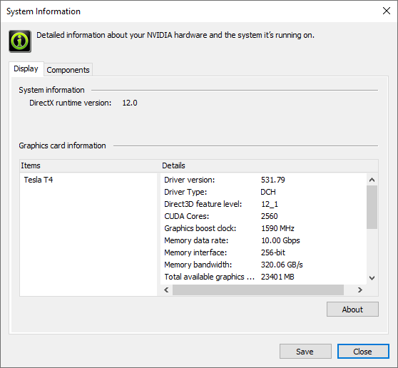
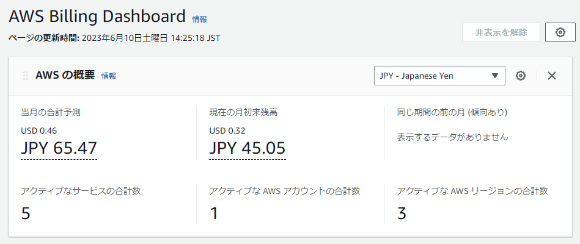
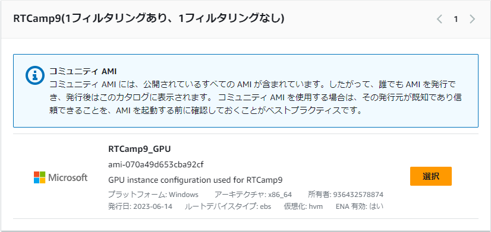
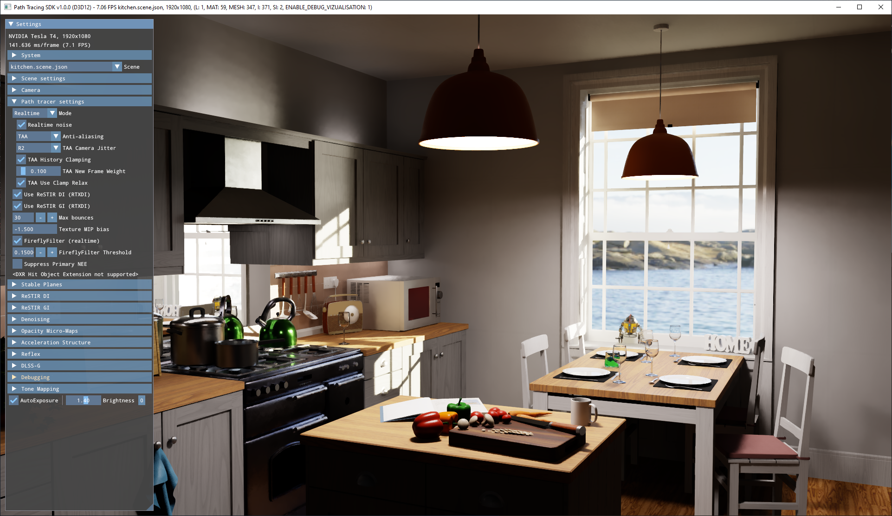

# レイトレ合宿 AWS EC2 101

各種情報確認日時：2023/06/05

## 用語

AWS: Amazon Web Services
- 今回使用するEC2などを含むAmazonのクラウドサービスの総称です。

EC2: Elastic Computing Cloud
- AWSの代表的なサービスのひとつでクラウド上に様々なOS、ハードウェアを組み合わせて仮想マシンを起動することができます。
  起動される仮想マシンを「インスタンス」と呼びます。
- 「インスタンスタイプ」によってハードウェア構成が決まります。
- 「リージョン」(米国や東京などの場所)を指定してインスタンスを起動します。

EBS: Elastic Block Store
- EC2のインスタンスが使用するストレージを提供するサービスです。
- EC2のインスタンスとはネットワークで接続されるようです(それなりには高速)。

インスタンスストア: dが名前につくインスタンスが持つ一時ストレージ
- EBSとは異なりインスタンスを実行している物理マシン内蔵のディスクのようです。
- レイトレ合宿では多分意識しません。

S3: Simple Storage Service
- クラウドストレージサービス、EC2など様々な手段で接続できます。
- レイトレ合宿参加者でちょっとEC2試す程度ならあまり使う必要はないです。
- EC2と同様リージョンを指定するので同一リージョンであればEC2インスタンスに対して高速にファイルが転送できます。

AMI: Amazon Machine Image
- OSの設定やアプリケーションのインストール情報などを記録、同じ状態のインスタンスを簡単に作れるようにするテンプレートのようなもの。

## EC2の課金について
インスタンス参考課金額 (東京, Windows)
| インスタンスタイプ | 料金 USD/h/instance | CPU | Mem | GPU | ストレージ | インスタンスストア | 備考 |
| - | - | - | - | - | - | - | - |
| [t2.micro](https://aws.amazon.com/jp/ec2/instance-types/t2/) | 0.0198 | 1 vCPU | 1 GiB | N/A | EBS | N/A | EC2おためしに最適 |
| [g4dn.xlarge](https://aws.amazon.com/jp/ec2/instance-types/g4/) | 0.894 | Cascade Lake 4 vCPU | 16 GiB | NVIDIA T4 | EBS | 125 GiB NVMe SSD | レイトレ合宿9 GPUインスタンス |
| [c6i.32xlarge](https://aws.amazon.com/jp/ec2/instance-types/c6i/) | 12.736 | Ice Lake 128 vCPU | 256 GiB | N/A | EBS | N/A | レイトレ合宿9 CPUインスタンス |

- 起動したインスタンスのタイプ、リージョン、OS等によって単価が変わり、起動時間(秒単位)に応じて課金されます。
- 起動したインスタンスを「停止」すると課金の大部分はストップしますが、EBSの課金(秒単位)は続きます。課金を完全にストップするにはインスタンスを「終了」する必要があります。インスタンスの停止であれば再開時にデータは残っていますが、終了の場合インスタンスを立て直した際にはデータはまっさらになっています。インスタンスストアはリブート以外ではデータが消えるようです。
  - 例: 汎用 SSD (gp2) ボリューム: 0.12 USD/GB/month (課金自体は秒単位)
- インスタンス停止時にEBS以外で課金される追加オプションはありますが、デフォルトであればおそらくEBSのみです。
- AWSサービスの使用においては常に自分が今どのリージョンの情報を見ているのか注意しましょう。例えば米国インスタンスを立ててもWebページ表示が東京リージョンになっていると起動中のインスタンスがぱっと見無いように見えるかもしれません。
- いっときのマイニングブームの際など、不正ログインされてインスタンスを大量に起動されたという被害も聞くので二要素認証などセキュリティは万全にしておきましょう。
- 事前設定した課金額で全サービスストップなどの機能は無いようですが、一定額で通知する設定は行うことができます。

## EC2でインスタンスを実際に作ってみる

注意：何やら(人によっては？)不正利用防止のためかデフォルトだとg4dnなどのインスタンスを起動できないようです。緩和申請を出す必要があるようです。

### 一から作る手順

※面倒なGPUインスタンスに関しては手順を簡略化できるようにAMIを作りました。後述の「レイトレ合宿AMIからGPUインスタンスを作る手順」も参照。具体的には下記の下準備とドライバーなどのインストールの手順が不要になります。

#### GPUインスタンス(g4dn)下準備

g4dnインスタンスでは特殊なNVIDIAドライバーのインストールを必要とする。その際にAWS S3へのアクセスを必要とするため「IAMロール」の作成が必要となる。ちなみにIAMとはIdentity and Access Managementの略。

1. AWSマネジメントコンソールにログイン。
1. サービス > セキュリティ、ID、およびコンプライアンス > IAM
1. アクセス管理 > ロール
1. ロールを作成をクリック。
1. 「AWSのサービス」が選択されていることを確認。\
   ユースケースは「EC2」を選択して「次へ」をクリック。
1. 許可ポリシーとして「AmazonS3ReadOnlyAccess」を選択して「次へ」をクリック。
1. ロール名としてなんでも良いが"S3_ReadAccess"などに設定して「ロールを作成」をクリック。

#### インスタンスの作成と接続

1. AWSマネジメントコンソールにログイン。
   画面上部からリージョンが東京になっていることを確認する。
   (米国インスタンスのほうが少し安いがファイル転送などで時間がかかるので大して変わらない or むしろ高くなる可能性)
1. サービス > コンピューティング > EC2
1. EC2ダッシュボードが表示されるので、「インスタンスを起動」をクリック。
1. 各項目を選んでインスタンス構成を決める。
   1. 名前とタグ\
      あってもなくても良い。
   1. アプリケーションおよびOSイメージ\
      クイックスタートから「Windows」を選択、「Microsoft Windows Server 2022 Base」を選択(されていることを確認)。
   1. インスタンスタイプ\
      GPUインスタンスであれば「g4dn.xlarge」を選択。(インスタンス名紛らわしいので高いのを選ばないよう注意)\
      CPUインスタンスであれば「c6i.32xlarge」だが、割りと高いので試すだけなら小さめのインスタンスで良い。
   1. キーペア\
      作成済みであれば該当のものを選択。未作成であれば「新しいキーペアの作成」をクリック。
   1. ネットワーク設定\
      作成済みであれば該当のものを選択。未作成であれば「セキュリティグループを作成する」にチェックを入れて、許可するRDPトラフィックとして「自分のIP」を選択。
   1. ストレージを設定\
      デフォルトの30GiBで足りない場合は値を変更する。(課金額もそんなに高くないですが上がります)\
      ※CUDAもインストールする場合は30GiBだと足りません。50-60GiBにすれば余裕があります。
   1. 高度な詳細\
      GPUインスタンスの場合は「IAMインスタンスプロフィール」として作成済みのIAMロールを選択。\
      CPUインスタンスの場合は「ユーザーデータ」に当リポジトリ内の `scripts/userdata.yml` の内容をコピー。
   1. 右の概要欄を確認して「インスタンスを起動」をクリック。\
      インスタンス数はとりあえず1で試すのが良い。
1. 「インスタンスを起動中」のようなメッセージが表示される。\
   「すべてのインスタンスを表示」をクリック。
1. 起動中のインスタンス一覧が表示される。
   接続したいインスタンスを選んで「接続」をクリック。
1. 「RDPクライアント」タブを選ぶ。
   「リモートデスクトップファイルのダウンロード」をクリックしてrdpファイルを手に入れる。\
   「パスワードを取得」をクリック(インスタンス起動直後はもう少し待てという旨のエラーが出る)、上記で作成済みのキーペアを選択してアップロード、「パスワードを復号化」をクリック。\
   ログインパスワードが表示されるのでコピー。
1. ダウンロードしたrdpファイルをダブルクリックしてリモートデスクトップ起動、接続、パスワード入力。\
   (ちなみにrdpファイル右クリックから編集に入ると解像度指定などができる。)

- `userdata.xml` (や下記のNVIDIAドライバー個別インストール用の `semiauto_set_up.ps1`)ではpythonのインストール、パスの設定を行っていますが、何やらたまに"python"とPowershellで打ってもコマンドが認識されないことがあるみたいです。その場合は再起動してみてください。

#### NVIDIAドライバーなどのインストール

1. 当リポジトリ内の `scripts/semiauto_set_up.ps1` を転送する。
1. CUDAツールキットの内容に依存しない場合は引数なしでPowerShellから次のように、\
   `C:\Users\Administrator\Desktop> .\semiauto_set_up.ps1`\
   依存する場合はCUDA 12.1のインストーラーを転送して次のように\
   `C:\Users\Administrator\Desktop> .\semiauto_set_up.ps1 path_to_cuda_installler`\
   スクリプトを実行。しばらく待つ。CUDA無しだと6分半くらいかかった。(よくある罠としてPowerShellなどでテキスト選択状態になってしまうとログが進まないので注意。)

- 2023/06/10時点では以下の画像に示すドライバーがインストールされました。\
  

#### インスタンスの終了

1. インスタンス一覧から該当のインスタンスを選んで\
   インスタンスの状態 > インスタンスを終了
   をクリック。

- 終了したインスタンス(「終了済み」ステータス)はおそらく1時間ほどは一覧に残る模様。
- 課金の確認(1日程度ラグがあります)はAWSマネジメントコンソールの自分の名前が表示されているところをクリック、「請求ダッシュボード」から行えます。JPYの値を確認しましょう。\
  

### レイトレ合宿AMIからGPUインスタンスを作る手順

基本は上記の一から作る手順と同じ。差異は以下。

- アプリケーションおよびOSイメージ\
  「その他のAMIを閲覧する」をクリック、検索欄に"RTCamp9"と入力して検索すると「コミュニティAMI」のタブ内に"RTCamp9_GPU"というAMIが見つかるはず。これを選択。
  
- 高度な詳細\
  NVIDIAドライバーはインストール済みなのでS3アクセス用のIAMロールの設定は不要。\
  今回はGPUインスタンスも「ユーザーデータ」に当リポジトリ内の `scripts/userdata.yml` の内容をコピー。

## その他

- 実行ファイルが何に依存しているかは [Dependencies](https://github.com/lucasg/Dependencies) などを使えば簡単にわかります。
- g4dnインスタンスでDXR, VkRT, OptiXのアプリケーションが起動することを確認しました。\
   
- NVIDIAドライバーに基本的なCUDA実行環境が含まれているため、簡単なOptiXのプログラムならCUDA Toolkitのインストール無しで起動できました。cuBLASなどを使っている場合はCUDA Toolkitのインストールが必要になると思います。

## 参考
- [Amazon EC2 料金](https://aws.amazon.com/jp/ec2/pricing/)
- [Amazon EC2 オンデマンド料金](https://aws.amazon.com/jp/ec2/pricing/on-demand/)
- [Amazon EBS の料金](https://aws.amazon.com/jp/ebs/pricing/)
- [「料金設定が月単位」「課金が秒単位」のAWS EBSの料金計算](https://qiita.com/tsukamoto/items/bd6b7cbf164e71beeba2)
- [Amazon S3 の料金](https://aws.amazon.com/jp/s3/pricing/)
- [EC2の揮発性ストレージ「インスタンスストア」を使ってみよう！](https://dev.classmethod.jp/articles/howto-ec2-volatile-block-storage-instance-store/)
- [インスタンスストアとは](https://qiita.com/miyuki_samitani/items/d5a38ef26f172311ade1)
